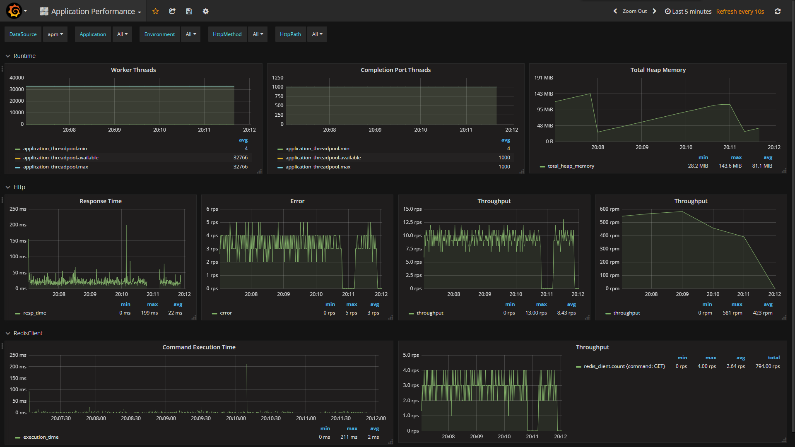

# AspectCore-APM
=====================
[](https://ci.appveyor.com/project/dotnet-lab/AspectCore-APM)

AspectCore-APM 旨在为.NET Core 应用程序提供一套应用性能监控管理(APM)方案，当前版本使用 `InfluxDb` 作为数据存储方案 `Grafana` 作为展示方案。

## 使用指南：

环境准备：

1、安装运行influxdb

下载链接：[influxdb](https://portal.influxdata.com/downloads)

2、安装运行Grafana

下载链接：[Grafana](http://docs.grafana.org/installation/)

3、执行命令 `influx` 进入influxdb CLI，并创建aspnetcore dataBase

```SQL
CREATE DATABASE aspectcore
```

4、配置并运行 `Grafana`

```BASH
sudo vi /etc/grafana/grafana.ini
```

将`http_addr`配置为您所需要的IP，如： `0.0.0.0:3000`

5、配置grafana数据源、图表

打开浏览器，进入Grafana站点: `http://IP:3000`

输入用户名/密码：admin/admin

选择添加DataSource，Type选择influxdb，并且database填入aspectcore


进入Dashbord选项，导入配置：https://grafana.com/dashboards/3837


外部环境准备就绪，创建.NET CORE应用：

1、创建ASP.NET Core应用

2、加入 `AspectCoreAPM` 相关依赖

```powershell
Install-Package AspectCore.APM.AspNetCore
Install-Package AspectCore.APM.LineProtocolCollector
Install-Package AspectCore.APM.ApplicationProfiler
```

修改Startup.cs文件：

```csharp
public class Startup
{
    public Startup(IConfiguration configuration)
    {
        Configuration = configuration;
    }

    public IConfiguration Configuration { get; }

    // This method gets called by the runtime. Use this method to add services to the container.
    public IServiceProvider ConfigureServices(IServiceCollection services)
    {
        services.AddMvc();

        services.AddAspectCoreAPM(component =>
        {
            component.AddApplicationProfiler(); //注册ApplicationProfiler收集GC和ThreadPool数据
            component.AddHttpProfiler();        //注册HttpProfiler收集Http请求数据
            component.AddLineProtocolCollector(options => //注册LineProtocolCollector将数据发送到InfluxDb
            {
                options.Server = "http://192.168.3.4:8086"; //你自己的InfluxDB Http地址
                options.Database = "aspectcore";    //你自己创建的Database
            });
        });

        return services.BuildAspectCoreServiceProvider(); //返回AspectCore AOP的ServiceProvider,这句代码一定要有
    }

    // This method gets called by the runtime. Use this method to configure the HTTP request pipeline.
    public void Configure(IApplicationBuilder app, IHostingEnvironment env)
    {
        app.UseAspectCoreAPM();     //启动AspectCoreAPM
        app.UseHttpProfiler();      //启动Http请求监控

        if (env.IsDevelopment())
        {
            app.UseDeveloperExceptionPage();
        }

        app.UseMvc();
    }
}
```

启动应用并访问页面。

回到Grafana，在DataSource处选择 `aspectcore`，就能看到我们的监控数据。
